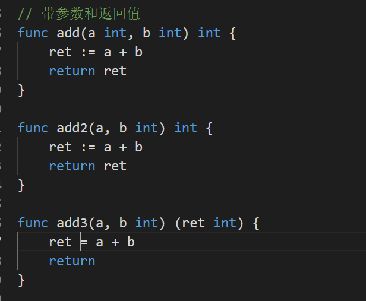
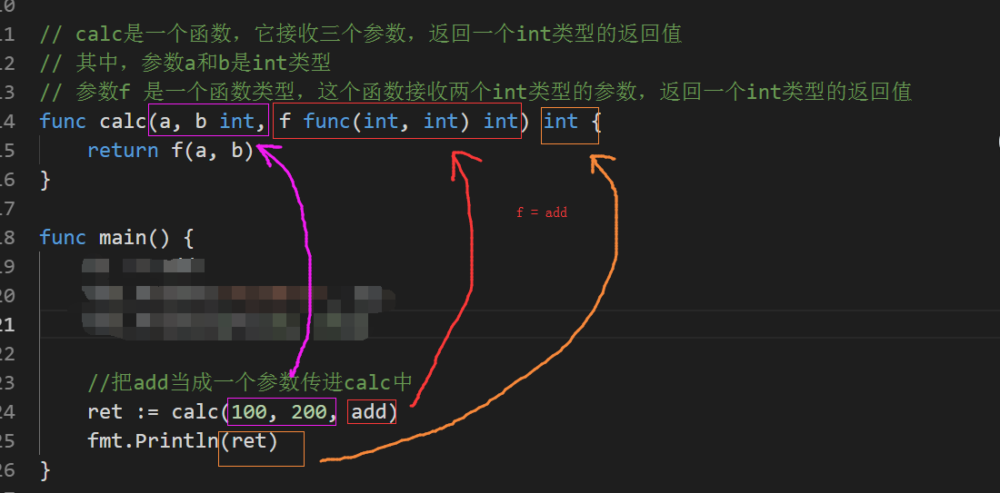

# day02


blog目录:[https://www.liwenzhou.com/posts/Go/go_menu/](https://www.liwenzhou.com/posts/Go/go_menu/)


# 今日内容

* 内容回顾+上周作业
* 运算符
* 数组
* 切片
* map
* 指针
* 函数

# 内容回顾

## 变量和常量

### 变量

#### 变量的定义

```go
var a int
var b bool 
var c int8

var (
	m int
    n string
)

var name string = "nazha"

func main(){
    age := 18//声明变量age同时初始化;编译器会根据右边的初始值推断出age是什么类型
}

```


### 常量

```go
const PI = 3.1415926

const KB = 1024
```


### iota

Go中借助iota来实现枚举

```go

const (
		n1 = iota //0
		n2        //1
		n3        //2
		n4        //3
	)
```


* `iota`在const关键字出现时将被重置为0
* const中每新增一行常量声明将使`iota`累加一次
* const声明的常量后面没有内容默认就跟上一行一致


	## 基本数据类型

### String

使用双引号表示`字符串` "hello"

使用单引号表示`字符`   'h'

字符串的常用方法

### 整型

int int8 int16 int32 int64

uint uint8 uint16 uint32 uint64


int是特殊的,会根据你的操作系统的位数来决定是int32还是int64


### 浮点型

float32 flot64

浮点数永远都是不精确.(为什么计算机表示的浮点数不精确)

* 转换成字符串去做运算

* 整体放大多少倍转换成整数进行运算

### 复数

complex64和complex128

### 布尔

```go
var a bool//默认是false
var b = true
```

Go语言中布尔类型不能和其他类型做类型转换

### byte和rune

英文字符用byte(ASCII码能表示的)   01010101 

rune(中文,UTF8编码)   01010101   01010101   01010101 

什么时候用rune?


```go
s := "hello中国"
for i:=0;i<len(s);i++{
    fmt.
}
```

详见课上代码.

## 流程控制

### if

```go
age := 20
if age>18{
    
}else if 20 > 18 {
    
}else{
    
}

//此时age只在if语句中有效
if age:=20;age>18{
    
}
```


### for

```go
//标准for循环
for i:=0;i<10;i++{
    
}

//类似while循环
n := 10
for n>0 {
    fmt.Println(n)
    n--
}

//无限循环
for {
    
}
```

### switch和case

```go
n := 10
switch n{
    case 1:
    ...
case 2:
    ...
}

switch {
    case n>0:
    ...
    case n ==0:
    ...
}

```

为了兼容之前的C代码 `fallthrough`

以下是了解为主

### goto+label

### continue+label

### break +label


## 作业

详见课上代码homework

## 运算符

[https://www.liwenzhou.com/posts/Go/03_operators/](https://www.liwenzhou.com/posts/Go/03_operators/)

### 课后练习

把字符串的IP地址"192.168.19.200"转换成整数

## 格式化打印的参数

```go

fmt.Println()
fmt.Printf("%s")

```


## 数组

数组是**同一种数据类型**元素的集合。

声明定义

初始化

二维数组

数组的遍历

数组是值类型

## 午后小分享

当你觉着不行的时候，你就去人行道上走一走，这个时候你就是一个行人。

## 切片


切片三要素：

* 地址（切片中第一个元素指向的内存空间） 
* 大小（切片中目前元素的个数）                   `len()`
* 容量（底层数组最大能存放的元素的个数）  `cap()`


切片支持自动扩容，扩容策略3种

* 每次只追加一个元素，每一次都是上一次的2倍

* 追加的超过原来容量的1倍，就等于原来的容量+扩容元素个数的最接近的偶数 

* 如果切片的容量大于了1024，后续就每次扩容0.25倍 ？


### 给切片追加元素

`append()`函数是往切片中追加元素的。

```go
a = append(a, 1)
```

### 得到切片的三种方式：

* 直接声明`a := []int{1,2,3}`  len:3 cap:3
* 基于数组得到切片 `m := [5]int  b:= m[:3]`  len:3, cap:5
* 基于切片得到切片 `b := a[:2]` len：2  cap:3

### 使用make初始化切片

make用于给引用类型申请内存空间

切片必须初始化，或者用append才能使用

```go
var s []int
s = make([]int, 大小, 容量)
```

对切片初始化时，容量尽量大一点，减少程序运行期间再去动态扩容。

## map

### map定义

`映射`, key-value结构

```go
var n map[string]int
```


### map初始化

```go
make(map[string]int, [容量])
```


### map的遍历

for ... range 循环


### 


## 函数





#### 可变参数

```go
func add4(a int, b ...int) int {
    
}
```


可变参数只能有一个并且只能放在参数的最后！！！

#### Go语言中没有默认参数！！！


#### 多返回值

```go
func add5() (int, int, int) {
	return 1, 2, 3
}
```




闭包的定义：

`闭包 = 函数 + 它引用的外层作用域的变量`


# 作业


1. 写一个程序，统计一个字符串中每个单词出现的次数。比如：”how do you do”中how=1 do=2 you=1。
2. 写一个程序，实现学生信息的存储，学生有id、年龄、分数等信息。要求通过id能够很方便的查找到对应学生的信息。

3. 


根据上图的要求实现`dispatchCoin()`函数。


## 


