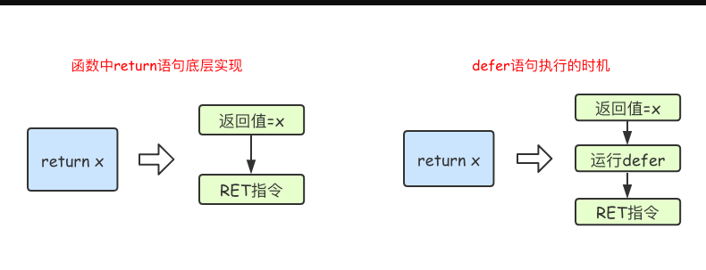
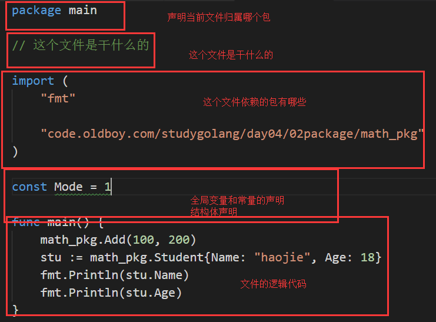

# day04 课上笔记

# 内容回顾

- **1**  [类型别名和自定义类型](https://www.liwenzhou.com/posts/Go/10_struct/#autoid-0-0-0)
- **1.1**  [自定义类型](https://www.liwenzhou.com/posts/Go/10_struct/#autoid-1-0-0)
- **1.2**  [类型别名](https://www.liwenzhou.com/posts/Go/10_struct/#autoid-1-1-0)
- **1.3**  [类型定义和类型别名的区别](https://www.liwenzhou.com/posts/Go/10_struct/#autoid-1-2-0)
- **2**  [结构体](https://www.liwenzhou.com/posts/Go/10_struct/#autoid-1-3-0)
- **2.1**  [结构体的定义](https://www.liwenzhou.com/posts/Go/10_struct/#autoid-2-0-0)
- **2.2**  [结构体实例化](https://www.liwenzhou.com/posts/Go/10_struct/#autoid-2-1-0)
- **2.2.1**  [基本实例化](https://www.liwenzhou.com/posts/Go/10_struct/#autoid-2-2-0)
- **2.2.2**  [匿名结构体](https://www.liwenzhou.com/posts/Go/10_struct/#autoid-2-2-1)
- **2.2.3**  [创建指针类型结构体](https://www.liwenzhou.com/posts/Go/10_struct/#autoid-2-2-2)
- **2.2.4**  [取结构体的地址实例化](https://www.liwenzhou.com/posts/Go/10_struct/#autoid-2-2-3)
- **2.3**  [结构体初始化](https://www.liwenzhou.com/posts/Go/10_struct/#autoid-2-2-4)
- **2.3.1**  [使用键值对初始化](https://www.liwenzhou.com/posts/Go/10_struct/#autoid-2-3-0)
- **2.4**  [结构体内存布局](https://www.liwenzhou.com/posts/Go/10_struct/#autoid-2-3-1)
- **2.5**  [构造函数](https://www.liwenzhou.com/posts/Go/10_struct/#autoid-2-4-0)
- **2.6**  [方法和接收者](https://www.liwenzhou.com/posts/Go/10_struct/#autoid-2-5-0)
- **2.6.1**  [指针类型的接收者](https://www.liwenzhou.com/posts/Go/10_struct/#autoid-2-6-0)
- **2.6.2**  [值类型的接收者](https://www.liwenzhou.com/posts/Go/10_struct/#autoid-2-6-1)
- **2.6.3**  [什么时候应该使用指针类型](https://www.liwenzhou.com/posts/Go/10_struct/#autoid-2-6-2)
- **2.7**  [任意类型添加方法](https://www.liwenzhou.com/posts/Go/10_struct/#autoid-2-6-3)
- **2.8**  [结构体的匿名字段](https://www.liwenzhou.com/posts/Go/10_struct/#autoid-2-7-0)
- **2.9**  [嵌套结构体](https://www.liwenzhou.com/posts/Go/10_struct/#autoid-2-8-0)
- **2.9.1**  [嵌套匿名结构体](https://www.liwenzhou.com/posts/Go/10_struct/#autoid-2-9-0)
- **2.9.2**  [嵌套结构体的字段名冲突](https://www.liwenzhou.com/posts/Go/10_struct/#autoid-2-9-1)
- **2.10**  [结构体的“继承”](https://www.liwenzhou.com/posts/Go/10_struct/#autoid-2-9-2)
- **2.11**  [结构体字段的可见性](https://www.liwenzhou.com/posts/Go/10_struct/#autoid-2-10-0)
- **2.12**  [结构体与JSON序列化](https://www.liwenzhou.com/posts/Go/10_struct/#autoid-2-11-0)
- **2.13**  [结构体tag](https://www.liwenzhou.com/posts/Go/10_struct/#autoid-2-12-0)

# 今日内容

## defer

return 的原理 和 defer执行时机

### 包（package）

### Go文件的代码结构

### 包的初始化

## Go语言标准包系列

### time包

记住一个时间：2006-01-02 15:04:05.000

am 和 pm 怎么格式化

## 接口（interface）

不要从字面意思上去理解这个概念。

接口就是一种类型，一种抽象的类型。

- 接口的定义
- 接口的实现
- 空接口
- 类型断言
- 值接收者和指针接收者实现接口的区别

## 日志库实战

日志库是一个写日志的库。因为自带的log过于基础。

### 日志

程序运行时是一个黑盒子。

日志是程序运行期间记录程序相关信息的方式，通常记录到文件里面。

### 日志库的需求

1. 支持往文件里面写日志
2. 支持往终端打印日志

# 作业

1. 把上课的代码要写完
   1. runtime.Caller()
   2. path.Base()
   3. fmt.Fprintf()
2. 把除了Debug外其他的日志级别都补充好
3. 实现一个日志按大小切分的功能
   1. 判断文件大小 file.Stat(),Size()
   2. 切分文件

# 今日分享

总监的故事

​	在公司里做事情要细致全面

​	最最最重要的是要学会发邮件！

只要思想不滑坡，方法总比问题多。