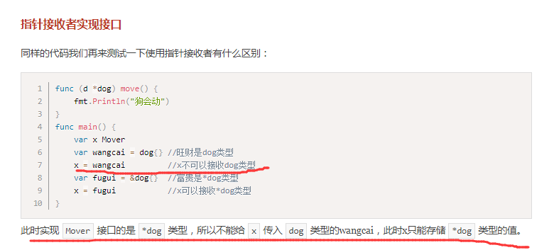
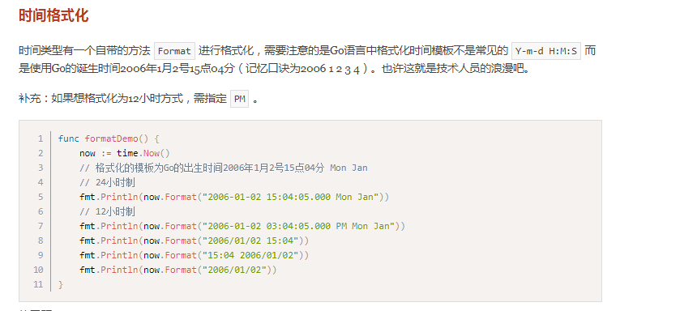

# day05课上笔记

# 内容回顾

## 接口

### 接口的定义

接口是一种类型，是一种抽象的类型。

是一个规范一个约定一堆方法签名的集合。

```go/

type mover interface {	
	move()
}
```

### 实现接口

实现了改接口规定的所有方法就实现了该接口


### 空接口

```go

interface{}
```

任意变量都可以存到空接口变量中


### 指针接收者和值接收者实现接口的区别




## 文件操作

打开文件

```go

os.Open()

os.OpenFile()
```

[博客](<https://www.liwenzhou.com/posts/Go/go_file/>)


## time包

格式化的时间：2006-01-02 15:04:05.000



[博客地址](<https://www.liwenzhou.com/posts/Go/go_time/>)

# 日志库作业讲解


什么是日志？为什么要有日志？非常重要


娜扎铁律：注释、日志、测试（单押x3）


详见课上代码mylogger

# 如何判断接口值保存的究竟是什么？

接口是一个引用类型。

接口值 由两部分组成， **动态类型**和**动态值**


## 类型断言

```go

// 接口值 由两部分组成， 类型和值

func main() {
	var x interface{} // <Type,Value>
	var a int64 = 100
	var b int32 = 10
	var c int8 = 1
	x = a     // <int64, 100>
	x = b     // <int32, 10>
	x = c     // <int8, 1>
	x = 12.34 // <float64, 12.34>
	x = false // <bool, false>
	fmt.Println(x)
    // 类型断言（猜）
	// 如果猜对了，ok=true,value=对应类型的值
	// 如果猜错了, ok=false,value=对应类型的零值
	value, ok := x.(int)
	fmt.Printf("ok:%t  value:%#v value type:%T/n", ok, value, value)
}
```

## 反射

类型太多了，类型断言猜不全，使用反射就能直接拿到接口值的动态类型和动态值。

### 反射的应用

各种web框架、配置文件解析库、ORM框架

### 反射试一把双刃剑

优点：让代码更灵活

缺点：运行效率低

[博客](<https://www.liwenzhou.com/posts/Go/13_reflect/>)


### strconv

将字符串转换为任意进制的整型

[博客](<https://www.liwenzhou.com/posts/Go/go_strconv/>)

# 本周作业

1. 日志库自己写一遍（按照时间切割做完 每小时一切）
2. 把课上反射的练习题做完
3. 自己手写一个ini文件的解析库


