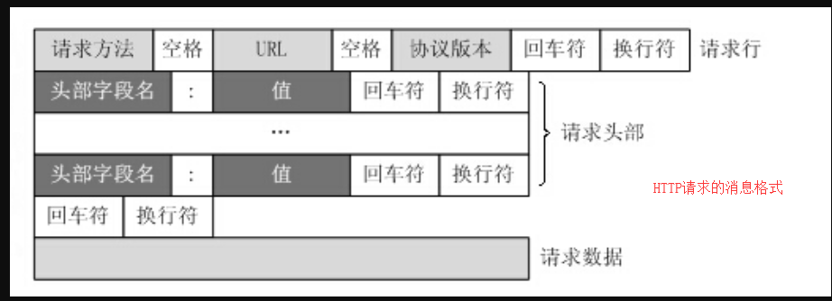
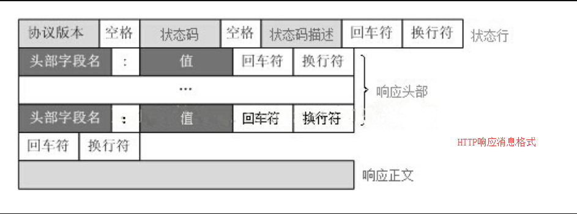

# day08 课上笔记


永远不要高估自己！

# 内容回顾

## 测试

### 写测试的必要性

很多公司会有代码检测（[sonar](<https://zhuanlan.zhihu.com/p/51089743>)），对开发写的代码有要求。

娜扎铁律：注释、日志、测试

### Go中测试

#### 单元测试

testing.T

测试组合子测试 `t.Run()`

测试覆盖率

#### 基准测试

`testing.B`  

`b.N`:不是固定的，保证测试用例至少跑够一秒钟，一秒钟究竟能执行多少次其实就不固定了。

性能比较(斐波那契数列的例子)

### 示例函数

ExampleName

### Setup和Teardown

Setup:测试开始之前做的一系列操作

Teardown:测试之后做的一系列操作


性能调优（后面项目会讲）


### 作业

编写一个回文判断函数，并为其编写测试。

详见课上代码 `homework`文件夹


## 网络编程

# 今日内容

## socket粘包问题

自定义一个消息协议：前四个字节保存数据长度，第四个字节往后保存的是真正的数据。

[大端和小端的概念](<https://zhuanlan.zhihu.com/p/36149865>)


## HTML基础

### Web本质


#### C/S架构

**优势**:可定制化高，用户体验好

**劣势**：开发成本高，添加新功能需要客户端升级

#### B/S架构  --> Web开发

**优势** 开发成本低

**劣势**：没办法做很多复杂的功能


#### net/http包


### HTML标签

#### 展示信息的标签

```html

```

#### 获取用户输入的标签

放到form标签中的 `input` `textarea`

提交的按钮：`submit`

```html

        <input type="submit" value="提交">
        <button type="submit">提交</button>

        <input type="reset" value="重置">
        <input type="button" value="普通按钮">
```


想要在HTML前面上通过点击form表单中的submit按钮提交数据：

 	1. 所有获取用户输入的标签必须放在form标签内
 	2. 所有获取用户输入的标签要有name属性
 	3. 必须要有submit按钮并且form表单要有action属性







#### 使用GET和POST

GET：获取页面和搜索引擎检索功能，会把请求的数据拼接到URL后面

POST:提交form表单数据的时候，会把请求的数据放到请求体中


## 标准库 template语法

模板渲染本质上就是字符串替换，是高级的字符串替换。


### 补充知识点

```go
// 链式操作
// 原理：每一次执行完方法之后返回操作的对象本身。
```

```go
type student struct {
	name string
}

func (s student) learn() student {
	fmt.Printf("%s热爱学习！/n", s.name)
	return s
}

func (s student) doHomework() student {
	fmt.Printf("%s热爱交作业！/n", s.name)
	return s
}

func main() {
	haojie := student{"豪杰"}
	haojie.learn().doHomework()

	// ret := haojie.learn()
	// ret.doHomework()
}
```


# 本周作业

使用`net/http`编写一个server端，返回一个HTML登录页面，登录页面要有用户名和密码两个输入框

输入完信息之后点提交能够把表单的数据发送到server端，server端校验用户名(alex)和密码(alexdsb)是否正确

`r.Method == "GET"`

